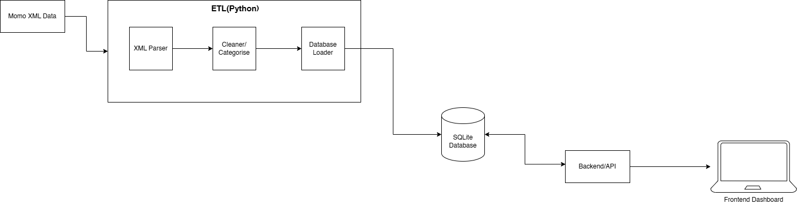

# Team 5 MoMo Transactions Analyzer

# Project Description
  
A full-stack application that processes Mobile Money SMS transactions, stores them in a database, and visualizes spending patterns.


# Team Members:
- Oke Joseph
- Nyayath Chol
- Oluwatomi Thompson

# Objective
This project demonstrates enterprise web development concepts including:
- Data processing and categorization
- Database integration
- System architecture design
- Agile team collaboration

# Features
- Process MoMo XML transaction data
- Clean and categorize transactions
- Store transaction data in SQLite database
- Display spending analytics on a dashboard

# Workflow
1. Upload XML transaction data
2. Parse and clean the data
3. Categorize transactions
4. Store data in the database
5. Display analytics on the dashboard


## Find the  Architecture Diagram on the attached link

Live-diagram: https://drive.google.com/file/d/15dNzSUR9f3embITlhbbbbPghnnTSQV8a/view?usp=sharing

## Scrum Board
https://github.com/users/Oluwatomi-Thompson/projects/1


# Assignment 2: Database Design & Implementation

## Overview

The database schema was designed and implemented in **MySQL** based on the ERD. It models a financial transaction system that supports users, transactions, categories, tags, and system logs.

The system also demonstrates **data serialization** by mapping relational database structures into nested JSON API responses.

---

## Key Features

* **Tables**:

  * `Users` – stores user information
  * `Transaction_Categories` – defines transaction types
  * `Transactions` – stores transaction records
  * `Tags` – reusable labels for transactions
  * `Transaction_Tags` – junction table for many-to-many relationship
  * `System_logs` – tracks system events

* **Referential Integrity**:

  * Enforced using `FOREIGN KEY` constraints between users, transactions, categories, and tags

* **Data Types**:

  * `DECIMAL(10,2)` for monetary values
  * `DATETIME` and `TIMESTAMP` for time tracking
  * `ENUM` for transaction status (`Success`, `Failed`, `Pending`)

* **Constraints**:

  * `UNIQUE` constraint on phone numbers and tag names
  * `CHECK` constraints:

    * `amount > 0`
    * `sender_id <> receiver_id`

* **Relationships**:

  * One-to-Many: Users → Transactions
  * One-to-Many: Categories → Transactions
  * Many-to-Many: Transactions ↔ Tags (via `Transaction_Tags`)

* **Logging System**:

  * Tracks transaction lifecycle events such as creation, completion, and failure

---

## Deliverables

* **Database Design Document**: `docs/`
* **ERD Diagram**: `docs/erd_diagram.png`
* **SQL Setup Script**: `database/database_setup.sql`
* **JSON Data Example**: `examples/transactions.json`

---

## Running the SQL Script

### Prerequisites

Install MySQL Server:

* **macOS**:

  ```bash
  brew install mysql
  ```

* **Linux**:

  ```bash
  sudo apt-get install mysql-server
  ```

* **Windows**:
  Download from: [https://dev.mysql.com/downloads/mysql/]

---

### Start MySQL Server

* **macOS/Linux**:

  ```bash
  mysql.server start
  ```

  or

  ```bash
  sudo service mysql start
  ```

* **Windows**:
  MySQL service starts automatically

---

### Log in to MySQL

```bash
mysql -u root -p
```

---

### Execute the SQL Script

**Option 1: From CLI**

```bash
mysql -u root -p < database/database_setup.sql
```

**Option 2: Inside MySQL Shell**

```sql
mysql -u root -p
mysql> source database/database_setup.sql;
```

---

## Testing

* CRUD operations tested successfully:

---

## Data Serialization

The system demonstrates how relational data is transformed into **nested JSON structures** for API responses.

### Example JSON Structure

Each transaction includes:

* Sender and receiver (nested user objects)
* Category (nested object)
* Tags (array of objects)
* System logs (array of objects)

### SQL to JSON Mapping
---

| SQL Table              | SQL Column       | JSON Key                                    | Data Type        | Implementation Note               |
| ---------------------- | ---------------- | ------------------------------------------- | ---------------- | --------------------------------- |
| Transactions           | transaction_id   | transaction_id                              | Integer          | Primary key mapping               |
| Transactions           | amount           | amount                                      | Decimal/Number   | Direct mapping                    |
| Transactions           | transaction_date | transaction_date                            | DATETIME/String  | Serialized using ISO 8601 format  |
| Transactions           | status           | status                                      | ENUM/String      | Serialized as string value        |
| Users                  | full_name        | sender.full_name / receiver.full_name       | Object/String    | Nested through foreign keys       |
| Users                  | phone_number     | sender.phone_number / receiver.phone_number | String           | Nested through foreign keys       |
| Transaction_Categories | name             | category.name                               | Object/String    | Nested category object            |
| Tags                   | tag_name         | tags[].tag_name                             | Array/String     | Many-to-many relationship mapping |
| System_logs            | description      | system_logs[].description                   | Text/String      | Stored as nested log objects      |
| System_logs            | log_time         | system_logs[].log_time                      | TIMESTAMP/String | Serialized using ISO 8601 format  |


--

## Notes on JSON vs SQL Design

* JSON includes **nested objects**, while SQL uses **normalized tables**
* Some fields in JSON (e.g., `currency`, `description`) are not explicitly stored in the current SQL schema
* Tags and logs are represented as **arrays**, mapped from relational tables
* Status values differ slightly:

  * SQL: `Success`, `Failed`, `Pending`
  * JSON: `success`, `failed`, `pending`

--

## Documentation

All project documentation, including:

* ERD
* Design decisions
* AI usage log

can be found in the `docs/` folder.

---

## Team

*TEAM 5: Enterprise Web Development*
